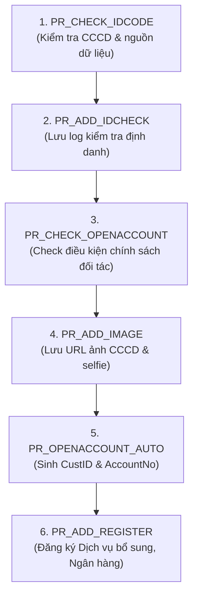

<!-- GENERATED FROM 02-codestyle/db-interface-procedure-flow/SKILL.md — DO NOT EDIT DIRECTLY -->

<!-- GENERATED FROM .shared/skills/02-codestyle/db-interface-procedure-flow/SKILL.md — DO NOT EDIT DIRECTLY -->

# Quy Trình Tích Hợp & Điều Phối Stored Procedures DB-Interface Chuẩn Enterprise

## 1. Mục Đích
Hướng dẫn tích hợp an toàn chuỗi Stored Procedures trên Database Core/Legacy thông qua lớp trung gian **Adapter Client** (`IDbInterfaceClient`), tuân thủ nguyên tắc không kết nối trực tiếp DB Core.

---

## 2. Chuỗi Stored Procedures / Integration Pipeline Cốt Lõi

---

## 3. Quy Tắc Gọi & Xử Lý Giao Dịch
1. **Tuần tự (Sequential)**: Bắt buộc thực thi theo thứ tự logic chặt chẽ từ bước 1 đến bước cuối.
2. **Kiểm tra Mã Lỗi (Fail-Fast)**: Sau mỗi Stored Procedure, kiểm tra `p_err_code == "0"`. Nếu khác 0, dừng ngay lập tức và ném `APIException` tương ứng kèm log chi tiết.
3. **Idempotency**: Đối với các thủ tục tạo tài khoản / cấp mã (`PR_OPENACCOUNT_AUTO`), kiểm tra xem khách hàng đã được cấp `custid` trước đó chưa để tránh tạo đúp bản ghi.
4. **Compensation & Retry**: Nếu các bước đầu thành công nhưng bước sau hoặc dịch vụ liên kết bên ngoài thất bại, ghi nhận trạng thái vào bảng `tbl_account_register` / Outbox để kích hoạt cơ chế Retry hoặc hỗ trợ Admin xử lý thủ công.
