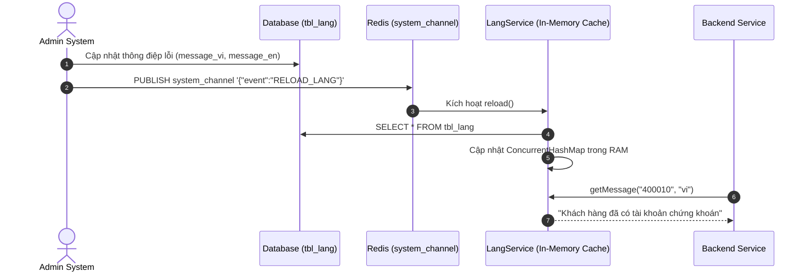

<!-- GENERATED FROM 02-codestyle/multi-language-error-handling/SKILL.md — DO NOT EDIT DIRECTLY -->

<!-- GENERATED FROM .shared/skills/02-codestyle/multi-language-error-handling/SKILL.md — DO NOT EDIT DIRECTLY -->

# Quy Trình Quản Lý & Xử Lý Lỗi Đa Ngôn Ngữ (i18n LangService)

## 1. Mục Đích
Hướng dẫn cơ chế hỗ trợ đa ngôn ngữ động cho mã lỗi và thông báo hệ thống, cho phép cập nhật từ Admin / Backoffice mà không cần redeploy code.

---

## 2. Kiến Trúc Hoạt Động

---

## 3. Quy Ước Viết Code
1. Mọi Exception ném ra từ Service phải dùng Enum `ErrorCodeDetail` (ví dụ: `ErrorCodeDetail.CUSTOMER_ALREADY_EXISTS`).
2. `APIExceptionHandler` sẽ gọi `langService.getMessage(error.code, locale)` để dịch ra ngôn ngữ của client theo header `Accept-Language`.
3. Fallback: Nếu không tìm thấy key trong database, `LangService` sẽ sử dụng message mặc định khai báo sẵn trong enum `ErrorCodeDetail`.
