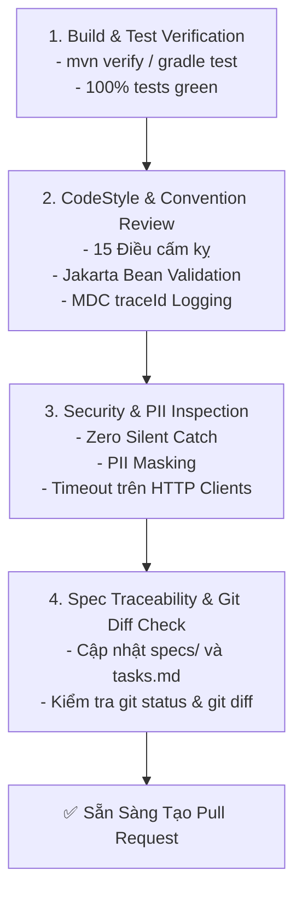

<!-- GENERATED FROM 03-hooks/post-code-verification/SKILL.md — DO NOT EDIT DIRECTLY -->

<!-- GENERATED FROM .shared/skills/03-hooks/post-code-verification/SKILL.md — DO NOT EDIT DIRECTLY -->

# Quy Trình 4 Bước Kiểm Định Chất Lượng Mã Nguồn (Post-Code Verification)

Skill này cung cấp quy trình nghiệm thu bắt buộc cho Kỹ sư và AI Coding Agents trước khi hoàn tất bất kỳ task lập trình nào trên repository Backend Microservices.

---

## 🔍 Quy Trình 4 Bước Nghiệm Thu Chuẩn Mực



---

### Bước 1: Kiểm Tra Biên Dịch & Chạy Unit Test
Thực thi lệnh kiểm tra build và kiểm thử tự động trong root project:
```bash
# Gradle:
./gradlew compileGroovy compileJava test

# Hoặc Maven:
./mvnw clean test
```
- **Tiêu chuẩn đạt**: Build thành công 100%, không có compilation warning/error, toàn bộ test cases đều passed.

---

### Bước 2: Rà Soát Quy Chuẩn Lập Trình (CodeStyle Review)
- [ ] Tên package, class, method, biến tuân thủ đúng quy tắc CamelCase / PascalCase.
- [ ] DTO Request có đầy đủ annotation validation (`@NotNull`, `@NotBlank`, `@Pattern`).
- [ ] Controller có `@Valid` và trích xuất `x-request-id` đưa vào `MDC.put("traceId", requestId)`.
- [ ] Response bọc trong `ResponseEntity<GeneralResponse<T>>`.

---

### Bước 3: Rà Soát An Toàn Bảo Mật & Lập Trình Phòng Thủ
- [ ] Không còn câu lệnh `println` hoặc `e.printStackTrace()`.
- [ ] Không có khối `catch` rỗng (Zero Silent Catch).
- [ ] Toàn bộ thông tin nhạy cảm (CCCD, SĐT, Email, OTP) được mask trước khi log.
- [ ] Mọi cuộc gọi HTTP ra bên ngoài đều có cấu hình Timeout ($< 5s$).
- [ ] Mọi xử lý file/stream đều dùng `try-with-resources`.

---

### Bước 4: Kiểm Tra Ranh Giới Git Diff & Đối Chiếu Đặc Tả SDD
1. Chạy `git status --short` và `git diff` để đảm bảo:
   - Chỉ sửa các file thuộc phạm vi task được giao.
   - Không vô tình sửa file cấu hình chung nếu không được yêu cầu.
2. Cập nhật tài liệu đặc tả tương ứng trong `.sdd/specs/` (đánh dấu `[x]` vào các task đã hoàn tất trong `TASKS.md` và checklist).
