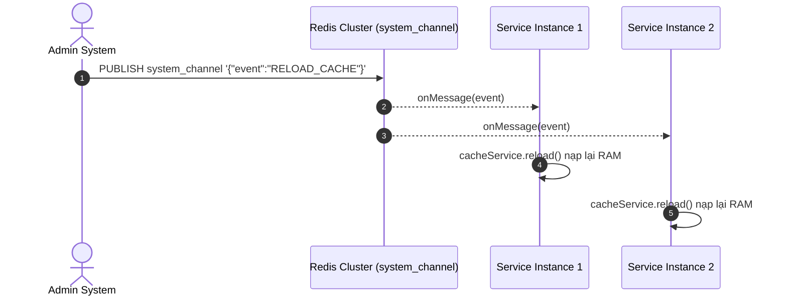

<!-- GENERATED FROM 02-codestyle/redis-cache-patterns/SKILL.md — DO NOT EDIT DIRECTLY -->

<!-- GENERATED FROM .shared/skills/02-codestyle/redis-cache-patterns/SKILL.md — DO NOT EDIT DIRECTLY -->

# Kỹ Thuật Tối Ưu Redis Cache & Pub/Sub Đồng Bộ Thời Gian Thực

Skill này cung cấp các nguyên tắc kiến trúc và mẫu thiết kế chuẩn mực khi làm việc với cụm Redis Cache / Redis Cluster trong các hệ thống Backend Microservices nhằm đảm bảo tốc độ phản hồi tính bằng mili-giây (< 5ms) và an toàn giao dịch.

---

## 1. 🔌 Nguyên Tắc Tối Ưu Kết Nối: Zero Connection Leak

- **Vấn đề:** Khởi tạo kết nối Redis client mới (`new Jedis()` hoặc `LettuceConnectionFactory.create()`) trong mỗi request của Service sẽ nhanh chóng làm cạn kiệt socket pool, gây nghẽn kết nối và sập Server.
- **Giải pháp:** Tái sử dụng Bean `RedisTemplate<String, Object>` hoặc `StringRedisTemplate` dạng Singleton do Spring IoC Container quản lý.

```groovy
@Service
@Slf4j
class IdempotencyService {

    @Autowired
    private StringRedisTemplate redisTemplate

    /**
     * Kiểm tra và khóa requestId trong 24h (Idempotency Key)
     * Trả về true nếu là request đầu tiên, false nếu bị duplicate
     */
    boolean lockRequestId(String requestId, String partnerCode) {
        String key = "idempotency:${partnerCode}:${requestId}"
        Boolean isNew = redisTemplate.opsForValue().setIfAbsent(key, "PROCESSING", Duration.ofHours(24))
        return Boolean.TRUE.equals(isNew)
    }
}
```

---

## 2. ⚡ Chiến Lược Truy Vấn: $O(1)$ vs $O(N)$

Tận dụng cấu trúc dữ liệu **Redis Hash** & **String Key-Value**:

| Thao tác | Cú pháp Spring Redis | Độ phức tạp | Mục đích sử dụng |
|---|---|:---:|---|
| **Lấy 1 key đơn** | `redisTemplate.opsForValue().get(key)` | $O(1)$ | Kiểm tra Idempotency Key, Token session |
| **Lấy 1 field trong Hash** | `redisTemplate.opsForHash().get(key, field)` | $O(1)$ | Lấy thông tin cấu hình của 1 đối tác / tenant cụ thể |
| **Lấy toàn bộ Hash** | `redisTemplate.opsForHash().entries(key)` | $O(N)$ | Lấy toàn bộ danh mục khi khởi động |
| **Lệnh CẤM trên Production** | `KEYS *` / `FLUSHALL` | $O(Total)$ | Tuyệt đối **CẤM** vì Redis đơn luồng, sẽ gây đóng băng toàn bộ cụm cluster |

---

## 3. 📡 Cơ Chế Đồng Bộ Cấu Hình Qua Redis Pub/Sub

Nhằm thỏa mãn nguyên tắc cô lập cấu hình và đồng bộ realtime:



### Cấu hình `RedisMessageListenerContainer`:

```groovy
@Configuration
class RedisPubSubConfig {

    @Bean
    RedisMessageListenerContainer redisContainer(
            RedisConnectionFactory connectionFactory,
            MessageListenerAdapter listenerAdapter) {
        RedisMessageListenerContainer container = new RedisMessageListenerContainer()
        container.setConnectionFactory(connectionFactory)
        container.addMessageListener(listenerAdapter, new ChannelTopic("system_channel"))
        return container
    }

    @Bean
    MessageListenerAdapter listenerAdapter(LangService langService) {
        return new MessageListenerAdapter(new MessageListener() {
            @Override
            void onMessage(Message message, byte[] pattern) {
                String body = new String(message.getBody())
                if (body.contains("RELOAD_LANG")) {
                    langService.reload()
                }
            }
        })
    }
}
```

---

## 4. ✅ Checklist Tự Kiểm Tra (Redis Cache Checklist)
- [ ] **Singleton Connection**: Sử dụng `StringRedisTemplate` được Spring quản lý, không tạo connection thủ công.
- [ ] **Cài đặt TTL**: 100% các key tạm thời (Idempotency, Session, Rate limit) đều có TTL xác định (ví dụ: `24h` hoặc `604800s`).
- [ ] **Đặt Prefix Key**: Toàn bộ key tuân theo định dạng có namespace: `service:idempotency:{partnerCode}:{requestId}`.
- [ ] **Không gọi KEYS ***: Dùng `SCAN` hoặc lưu index vào `Set` thay vì tìm kiếm wildcards trên production.
