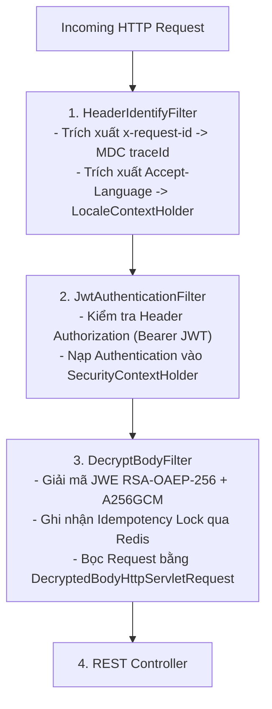

<!-- GENERATED FROM 02-codestyle/spring-middleware-pipeline/SKILL.md — DO NOT EDIT DIRECTLY -->

<!-- GENERATED FROM .shared/skills/02-codestyle/spring-middleware-pipeline/SKILL.md — DO NOT EDIT DIRECTLY -->

# Quy Chuẩn Thiết Kế & Vận Hành Chuỗi Middleware (Servlet Filter & Spring Interceptor Pipeline)

Tài liệu này định nghĩa kiến trúc, luồng thực thi và quy chuẩn lập trình chuỗi Middleware (Filter & Interceptor) trong hệ thống Backend Spring Boot (Spring Boot 3, Spring Security 6, Groovy 4 / Java 21).

---

## 1. Phân Định Kiến Trúc: Filter vs Interceptor vs ControllerAdvice

Hiểu đúng vị trí và vòng đời của từng thành phần trong chuỗi xử lý HTTP Request:

```text
HTTP Request
     │
     ▼
[Tomcat / Servlet Container]
     │
     ├─► 1. Servlet Filters (OncePerRequestFilter)
     │     ├── HeaderIdentifyFilter (LocaleContextHolder, MDC traceId)
     │     ├── JwtAuthenticationFilter (Verify Bearer Token)
     │     └── DecryptBodyFilter (JWE RSA Decryption + Redis Idempotency)
     │
     ▼
[Spring DispatcherServlet]
     │
     ├─► 2. HandlerInterceptors (preHandle)
     │     └── RateLimitInterceptor (Kiểm tra quota, dynamic routing)
     │
     ▼
[Controller Layer (@RestController)]
     │
     ├─► @Valid RequestBody & Service Execution
     │
     ▼
[ControllerAdvice / APIExceptionHandler] (Xử lý nếu phát sinh ngoại lệ)
     │
     ▼
[HandlerInterceptors (postHandle & afterCompletion)]
     │
     ▼
[Servlet Filters (Sau khi response hoàn tất: Cleanup MDC, Logging)]
     │
     ▼
HTTP Response
```

### Bảng So Sánh Chi Tiết

| Đặc Tính | Servlet Filter (`Filter` / `OncePerRequestFilter`) | HandlerInterceptor (`HandlerInterceptor`) |
| :--- | :--- | :--- |
| **Vị Trí Thực Thi** | Ngoài DispatcherServlet (Tầng Servlet Container). | Trong DispatcherServlet (Tầng Spring MVC). |
| **Truy Cập Request Body** | Trực tiếp qua `HttpServletRequest.getInputStream()`. | Không đọc trực tiếp InputStream (dùng RequestWrapper). |
| **Truy Cập Spring Context** | Gián tiếp (phải inject Spring Bean cẩn thận). | Trực tiếp (có quyền truy cập `HandlerMethod`). |
| **Nhiệm Vụ Phù Hợp** | Giải mã JWE, Xác thực JWT, Quản lý MDC `traceId`, Caching Body, CORS, Gzip. | Đo lường thời gian thực thi (Metrics), Rate Limit theo Controller method, Phân quyền chi tiết theo Annotation. |

---

## 2. Mô Hình Chuỗi Filter Chuẩn (Security Filter Pipeline)



---

## 3. Kỹ Thuật Request Body Caching & Wrapper (Đọc Body Nhiều Lần)

### Vấn đề:
`HttpServletRequest.getInputStream()` là một One-time Stream. Sau khi Filter đọc giải mã JWE hoặc ghi log, Stream sẽ bị đóng/rỗng, khiến `@RequestBody` tại Controller bị lỗi `HttpMessageNotReadableException`.

### Giải Pháp: `HttpServletRequestWrapper`
Bắt buộc bọc dữ liệu đã đọc vào một Wrapper tùy biến và truyền tiếp qua chuỗi `filterChain.doFilter(wrapper, response)`:

```groovy
class DecryptedBodyHttpServletRequest extends HttpServletRequestWrapper {

    private final byte[] cachedBody

    DecryptedBodyHttpServletRequest(HttpServletRequest request, byte[] decryptedContent) {
        super(request)
        this.cachedBody = decryptedContent ?: new byte[0]
    }

    @Override
    ServletInputStream getInputStream() throws IOException {
        ByteArrayInputStream byteArrayInputStream = new ByteArrayInputStream(this.cachedBody)
        return new CustomServletInputStream(byteArrayInputStream)
    }

    @Override
    BufferedReader getReader() throws IOException {
        return new BufferedReader(new InputStreamReader(this.getInputStream(), StandardCharsets.UTF_8))
    }
}
```

---

## 4. Quản Lý MDC Logging & Dọn Dẹp Bộ Nhớ (ThreadLocal Cleanup)

Để tránh rò rỉ bộ nhớ (Memory Leak) và lẫn lộn log giữa các Request trên Thread Pool của Tomcat, MDC Context phải được dọn sạch tại khối `finally` của Filter đầu tiên:

```groovy
@Component
class HeaderIdentifyFilter extends OncePerRequestFilter {

    @Override
    protected void doFilterInternal(HttpServletRequest request, 
                                    HttpServletResponse response, 
                                    FilterChain filterChain) throws ServletException, IOException {
        String requestId = request.getHeader("x-request-id") ?: UUID.randomUUID().toString()
        MDC.put("traceId", requestId)
        response.setHeader("x-request-id", requestId)

        try {
            filterChain.doFilter(request, response)
        } finally {
            // Bắt buộc dọn sạch MDC để tránh leak dữ liệu sang request tiếp theo trên cùng thread
            MDC.remove("traceId")
            MDC.clear()
        }
    }
}
```

---

## 5. Xử Lý Ngoại Lệ Tại Tầng Filter (Filter-Level Exception Handling)

Ngoại lệ phát sinh trong Servlet Filter nằm ngoài tầm quét của `@RestControllerAdvice`. Để xử lý chuẩn, sử dụng `HandlerExceptionResolver` để chuyển tiếp ngoại lệ về `APIExceptionHandler`:

```groovy
@Component
class JwtAuthenticationFilter extends OncePerRequestFilter {

    @Autowired
    @Qualifier("handlerExceptionResolver")
    private HandlerExceptionResolver resolver

    @Override
    protected void doFilterInternal(HttpServletRequest request, 
                                    HttpServletResponse response, 
                                    FilterChain filterChain) throws ServletException, IOException {
        try {
            // Thực hiện xác thực JWT...
            filterChain.doFilter(request, response)
        } catch (Exception e) {
            // Đẩy ngoại lệ về APIExceptionHandler để định dạng response JSON chuẩn
            resolver.resolveException(request, response, null, e)
        }
    }
}
```

---

## 6. Quy Chuẩn Thiết Kế HandlerInterceptor

Khi cần chặn ở tầng Spring MVC (sau khi đã biết chính xác Controller nào sẽ xử lý):

```groovy
@Component
class ExecutionTimeInterceptor implements HandlerInterceptor {

    private static final String START_TIME_ATTR = "INTERCEPTOR_START_TIME"

    @Override
    boolean preHandle(HttpServletRequest request, HttpServletResponse response, Object handler) {
        request.setAttribute(START_TIME_ATTR, System.currentTimeMillis())
        return true
    }

    @Override
    void afterCompletion(HttpServletRequest request, HttpServletResponse response, Object handler, Exception ex) {
        Long startTime = (Long) request.getAttribute(START_TIME_ATTR)
        if (startTime) {
            long duration = System.currentTimeMillis() - startTime
            if (duration > 1000) {
                // Log cảnh báo API chạy chậm (Slow API Warning)
                log.warn("[SLOW_API] URL: {}, Duration: {} ms", request.requestURI, duration)
            }
        }
    }
}
```

---

## 7. Bảng Kiểm Định An Toàn Cho Middleware (Review Checklist)

| STT | Tiêu Chí Kiểm Tra | Đạt Chuẩn |
| :---: | :--- | :---: |
| 1 | Filter có kế thừa `OncePerRequestFilter` để tránh thực thi nhiều lần trên 1 request không? | ĐẠT |
| 2 | Nếu Filter đọc InputStream, đã bọc lại vào `HttpServletRequestWrapper` chưa? | ĐẠT |
| 3 | Khối `finally` của Filter đầu tiên đã có `MDC.clear()` để tránh rò rỉ ThreadLocal chưa? | ĐẠT |
| 4 | Ngoại lệ trong Filter có được chuyển tiếp qua `HandlerExceptionResolver` không? | ĐẠT |
| 5 | Các Filter có được cấu hình thứ tự tường minh qua `SecurityFilterChain` hoặc `@Order` không? | ĐẠT |
