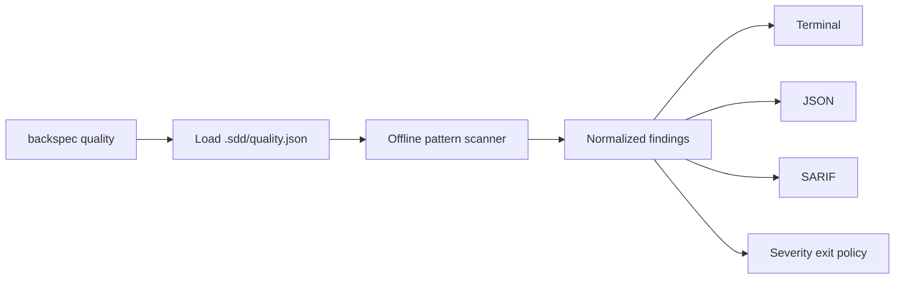

# [PLAN] Agent Code Quality Gate

## Module

- `lib/quality/rules.js`: rule catalog bất biến.
- `lib/quality/scanner.js`: traversal, matching, redaction và summary.
- `lib/quality/reporters.js`: terminal model, JSON và SARIF.
- `lib/commands/quality.js`: CLI boundary và exit policy.
- `.sdd/quality.json`: policy của toolkit source.
- `.github/workflows/quality.yml`: CI matrix.

## Luồng

## Kiểm thử

- Tạo fixture trong OS temp.
- Không chứa secret literal trực tiếp trong repository test.
- Assert rule IDs, line number, redaction, clean result và SARIF schema.
