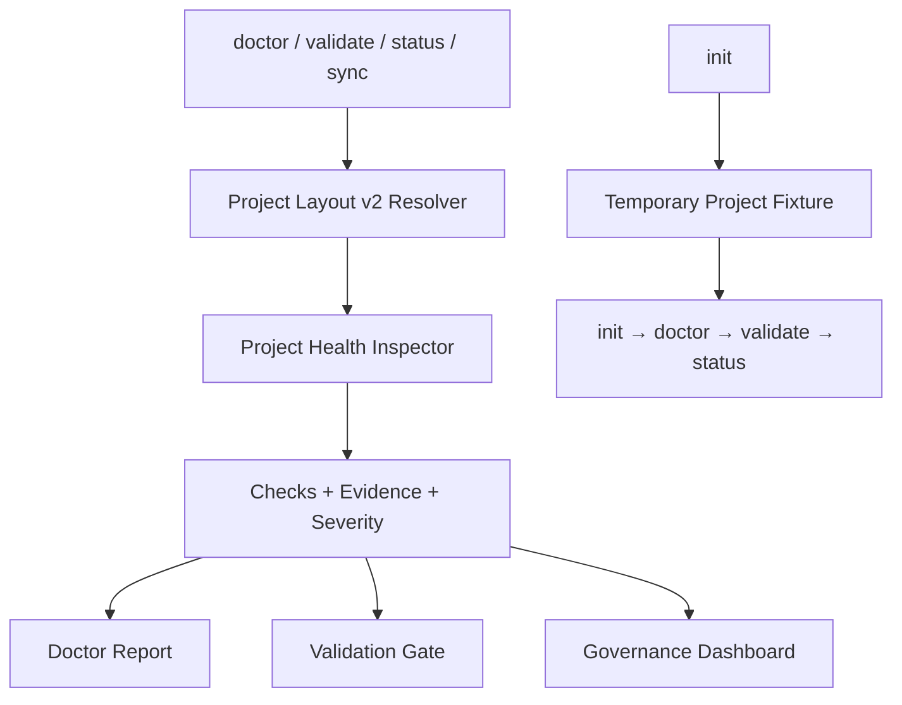

# [PLAN] BackSpec Trust Reset

## 1. Thiết kế

## 2. Module

- `lib/utils/project-layout.js`: resolve canonical paths, skill/rule/spec inventory và capability state.
- `lib/utils/project-health.js`: chạy rule-based checks và trả snapshot dùng chung.
- `lib/commands/doctor.js`: chỉ render snapshot.
- `lib/commands/validate.js`: render validation details, trả result và điều khiển exit.
- `lib/commands/status.js`: render số liệu thật.
- `lib/utils/file-system.js`: atomic/safe generated-file writes.
- `tests/test-skill-system.js`: hermetic contract test.

## 3. Tương thích

- Giữ API command hiện có.
- Toolkit source dùng `registry`; project đã init dùng `.sdd` và engine skill folders.
- Không yêu cầu người dùng giữ bốn thư mục legacy.

## 4. Kiểm thử

- Unit checks cho resolver và safe write.
- Contract test fresh init với Claude integration.
- Source registry validation.
- CLI smoke test `doctor`, `validate`, `status`, `sync --check`.
