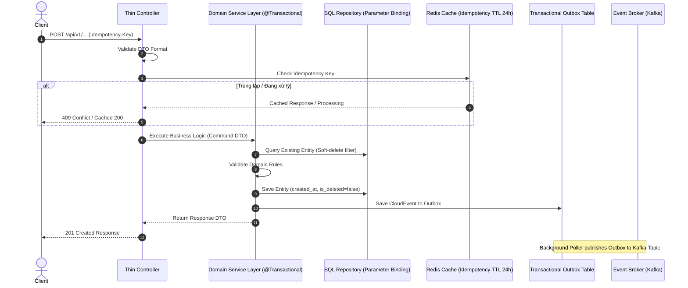

# [PLAN] feat-process-payment — Architectural & Technical Plan

---

## 1. KIẾN TRÚC TỔNG THỂ & LUỒNG THỰC THI (ARCHITECTURE)



---

## 2. RANH GIỚI TRANSACTION & AN TOÀN DỮ LIỆU
1. **Transaction Boundary:** CHỈ đặt `@Transactional` tại Service Layer. Tuyệt đối không đặt ở Controller hoặc Repository.
2. **Isolation Level:** Read Committed.
3. **Rollback Rules:** Rollback toàn bộ khi gặp bất kỳ `RuntimeException` hoặc `BusinessException`.
4. **Zero N+1 Query:** Sử dụng Projection DTO hoặc `JOIN FETCH` khi truy vấn liên kết.

---

## 3. STATE TRANSITION MACHINE (QUẢN LÝ TRẠNG THÁI)
```
[CREATED] ──(validate)──► [PROCESSING] ──(success)──► [COMPLETED]
                                │
                                └──(failed)──► [FAILED] (Compensation)
```

---

## 4. KẾ HOẠCH ROLLBACK & DỰ PHÒNG RỦI RO
- **DB Migration:** Tạo script down migration tương ứng.
- **Feature Flag:** Cấu hình toggle bật/tắt tính năng qua config server.
- **Graceful Fallback:** Khi Redis sập, fallback sang kiểm tra DB lock tạm thời.
