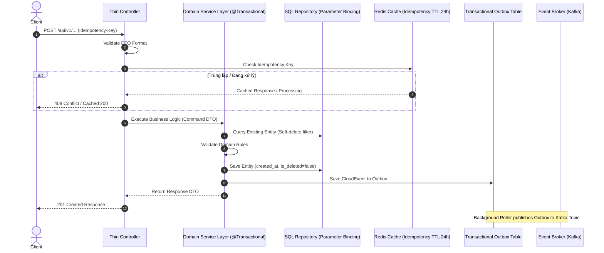

# 📦 COMPLETE SPECIFICATION BUNDLE: feat-process-payment

> Exported on: 2026-09-28T06:29:02.274Z

---

## 📄 SPEC.md

# [SPEC] feat-process-payment

> **Status:** DRAFT | **Author:** intern | **Created:** 2026-09-28 | **Service:** backend_microservice

---

## 1. TỔNG QUAN & MỤC TIÊU NGHIỆP VỤ (OVERVIEW)
### 1.1. Bối cảnh
- **Mục tiêu:** _{Mô tả mục tiêu của tính năng và giá trị mang lại cho hệ thống}_
- **Bounded Context:** `backend_microservice`
- **Phân loại Module:** `CORE` (Nghiệp vụ cốt lõi) / `SHELL` (Tích hợp, Adapter)

### 1.2. User Stories & Acceptance Criteria
- **US-01:** Là một _{Actor}_, tôi muốn _{Hành động}_ để _{Kết quả mong muốn}_.
  - **AC-1.1 (Happy Path):** Given _{Điều kiện hợp lệ}_, When _{Gọi API/Sự kiện}_, Then _{Trả về 200/201 và dữ liệu DTO}_.
  - **AC-1.2 (Validation Error):** Given _{Dữ liệu sai định dạng}_, When _{Gọi API}_, Then _{Trả về 400 Bad Request kèm chi tiết trường lỗi}_.
  - **AC-1.3 (Business Error):** Given _{Vi phạm luật nghiệp vụ}_, When _{Thực thi}_, Then _{Trả về 422 Unprocessable Entity kèm error code}_.

---

## 2. API CONTRACT & DTO PATTERN (BẮT BUỘC)
> [!IMPORTANT]
> **ZERO ENTITY LEAK**: Tuyệt đối không nhận hoặc trả Entity trực tiếp ra API. Mọi dữ liệu phải thông qua DTO.

### 2.1. Endpoint Definitions
- **Method & Path:** `POST /api/v1/feat-process-payment`
- **Header:** `Idempotency-Key: <UUID>` (Bắt buộc cho thao tác tạo mới/thay đổi)

### 2.2. Request DTO Schema
```json
{
  "reference_id": "string (UUID, required)",
  "account_type": "string (ENUM: PERSONAL, ENTERPRISE, required)",
  "amount": "number (min: 0, required)",
  "metadata": {
    "source": "string"
  }
}
```

### 2.3. Response DTO Schema (Standard Format)
```json
{
  "status": 200,
  "message": "Resource created successfully",
  "data": {
    "id": "UUID",
    "status": "ACTIVE",
    "created_at": "2026-09-28T00:00:00Z"
  }
}
```

### 2.4. Ma trận Mã lỗi (RFC 7807 Standard Error Matrix)
| HTTP Status | Error Code | Điều kiện kích hoạt | Phản hồi RFC 7807 |
|---|---|---|---|
| 400 | `ERR_INVALID_FORMAT` | Request DTO thiếu trường bắt buộc hoặc sai regex | `{ "type": "about:blank", "title": "Bad Request", "detail": "..." }` |
| 401 | `ERR_UNAUTHORIZED` | Token JWT thiếu hoặc hết hạn | `{ "title": "Unauthorized", "detail": "Token expired" }` |
| 403 | `ERR_FORBIDDEN` | Không có quyền truy cập tài nguyên | `{ "title": "Forbidden", "detail": "Access denied" }` |
| 409 | `ERR_IDEMPOTENCY_CONFLICT` | Idempotency Key đang được xử lý | `{ "title": "Conflict", "detail": "Request is processing" }` |
| 422 | `ERR_BUSINESS_VIOLATION` | Số dư không đủ / Trạng thái không hợp lệ | `{ "title": "Unprocessable Entity", "detail": "..." }` |
| 500 | `ERR_INTERNAL_SERVER` | Lỗi hệ thống ngoài ý muốn | `{ "title": "Internal Server Error" }` |

---

## 3. DATABASE SCHEMA & MIGRATION PLAN
- **Bảng tác động:** `tbl_feat_process_payment`
- **Migration File mới:** `V20260928__create_feat_process_payment_table.sql`
- **Audit Columns (Bắt buộc):** `created_at`, `updated_at`, `created_by`
- **Soft Delete (Bắt buộc):** `is_deleted BOOLEAN DEFAULT FALSE` (hoặc `status VARCHAR(30)`)

---

## 4. DISTRIBUTED RESILIENCE & SAGA INTEGRATION
- **Idempotency:** Kiểm tra Idempotency Key trong Redis với TTL 24h.
- **Transactional Outbox:** Khi lưu DB thành công, đồng thời insert bản ghi vào `tbl_outbox` trong cùng một Local Transaction.
- **Timeout Configuration:** Timeout gọi mạng tối đa `3000ms`.
- **Circuit Breaker:** Ngắt mạch khi tỷ lệ lỗi > 50% trong 10 calls liên tiếp.

---

## 📄 PLAN.md

# [PLAN] feat-process-payment — Architectural & Technical Plan

---

## 1. KIẾN TRÚC TỔNG THỂ & LUỒNG THỰC THI (ARCHITECTURE)



---

## 2. RANH GIỚI TRANSACTION & AN TOÀN DỮ LIỆU
1. **Transaction Boundary:** CHỈ đặt `@Transactional` tại Service Layer. Tuyệt đối không đặt ở Controller hoặc Repository.
2. **Isolation Level:** Read Committed.
3. **Rollback Rules:** Rollback toàn bộ khi gặp bất kỳ `RuntimeException` hoặc `BusinessException`.
4. **Zero N+1 Query:** Sử dụng Projection DTO hoặc `JOIN FETCH` khi truy vấn liên kết.

---

## 3. STATE TRANSITION MACHINE (QUẢN LÝ TRẠNG THÁI)
```
[CREATED] ──(validate)──► [PROCESSING] ──(success)──► [COMPLETED]
                                │
                                └──(failed)──► [FAILED] (Compensation)
```

---

## 4. KẾ HOẠCH ROLLBACK & DỰ PHÒNG RỦI RO
- **DB Migration:** Tạo script down migration tương ứng.
- **Feature Flag:** Cấu hình toggle bật/tắt tính năng qua config server.
- **Graceful Fallback:** Khi Redis sập, fallback sang kiểm tra DB lock tạm thời.

---

## 📄 TASKS.md

# [TASKS] feat-process-payment — Implementation Checklist

> **Quy tắc:** Thực hiện tuần tự từng task. Đánh dấu [x] khi hoàn thành. Không để TODO comment trong code đã merge.

---

### 📦 Giai đoạn 1: Database Migration & Schema (Data Layer)
- [ ] **Task 1.1:** Tạo file migration mới cho bảng dữ liệu (đủ audit columns: `created_at`, `updated_at`, `created_by`, `is_deleted`).
- [ ] **Task 1.2:** Viết migration kiểm thử và kiểm tra rollback script.
- [ ] **Task 1.3:** Khởi tạo Entity class ánh xạ chuẩn DB (đầy đủ soft delete annotation).

### ⚙️ Giai đoạn 2: DTO Contracts & Repository Layer
- [ ] **Task 2.1:** Tạo Request DTO với đầy đủ validation constraints (`@NotNull`, `@Size`, bounds, regex).
- [ ] **Task 2.2:** Tạo Response DTO chuẩn format `{ status, message, data }`.
- [ ] **Task 2.3:** Xây dựng Repository interface với Parameterized Query chống SQL Injection.

### 🧠 Giai đoạn 3: Domain Service Layer & Business Logic
- [ ] **Task 3.1:** Khởi tạo Service Layer với `@Transactional` boundary.
- [ ] **Task 3.2:** Cài đặt logic kiểm tra Idempotency Key (TTL 24h).
- [ ] **Task 3.3:** Xử lý State Transition và Transactional Outbox event generation.
- [ ] **Task 3.4:** Map kết quả từ Entity sang Response DTO (Zero Entity Leak).

### 🌐 Giai đoạn 4: Controller & Error Handling
- [ ] **Task 4.1:** Tạo Lean Controller nhận Request DTO và gọi Service.
- [ ] **Task 4.2:** Đăng ký mã lỗi RFC 7807 vào Global Exception Handler.
- [ ] **Task 4.3:** Thiết lập timeout và Circuit Breaker cho các lời gọi mạng liên quan.

### 🧪 Giai đoạn 5: Testing Suite (Coverage >= 80%)
- [ ] **Task 5.1:** Viết Unit Test cho Service Layer (Happy Path & All Error Cases).
- [ ] **Task 5.2:** Viết Integration Test cho Controller Endpoint (Mock external HTTP/Kafka).
- [ ] **Task 5.3:** Chạy test suite và đối chiếu coverage đạt >= 80% theo CONSTITUTION §5.

### 🛡️ Giai đoạn 6: Code Review Gate & DoD Verification
- [ ] **Task 6.1:** Chạy linter & format code (0 warning).
- [ ] **Task 6.2:** Kiểm tra không có Hardcoded Secrets, không có `SELECT *`, không có TODO comments.
- [ ] **Task 6.3:** Xác thực kích thước code: Method <= 40 dòng, File <= 300 dòng.

---

## 📄 CHANGELOG.md

# [CHANGELOG] feat-process-payment

### Version 1.0.0-draft (2026-09-28)
- **Tác giả:** intern
- **Nội dung:** Khởi tạo đặc tả kỹ thuật SDD ban đầu cho tính năng `feat-process-payment`.
- **Trạng thái:** DRAFT -> READY FOR REVIEW.

---

## 📄 CHECKLIST.md

# [CHECKLIST] feat-process-payment — Quality & Acceptance Verification

> **Mục đích:** Danh mục kiểm định chất lượng bắt buộc trước khi phê duyệt spec hoặc merge code.

---

### 📋 1. Tính Đầy Đủ Của Đặc Tả (Specification Completeness)
- [ ] User Stories & Acceptance Criteria (Given-When-Then) đã được mô tả chi tiết.
- [ ] Đã xác định rõ phân tầng Bounded Context (`CORE` vs `SHELL`).
- [ ] Ma trận mã lỗi RFC 7807 (400, 401, 403, 404, 409, 422, 500) được định nghĩa đầy đủ.

### 🛡️ 2. An Toàn & Chuẩn DTO (Zero Entity Leak)
- [ ] Request DTO có đầy đủ validation annotations (`@NotNull`, bounds, regex).
- [ ] Response DTO tuân thủ chuẩn format `{ "status": 200, "message": "...", "data": ... }`.
- [ ] Tuyệt đối 0 Entity lọt trực tiếp ra Controller hoặc Event Broker.

### 💾 3. Dữ Liệu & Database Migration
- [ ] Tạo file migration mới (không sửa file cũ).
- [ ] Bảng có đủ audit columns (`created_at`, `updated_at`, `created_by`).
- [ ] Cơ chế Soft Delete (`is_deleted` hoặc `status`) được áp dụng 100%.

### ⚡ 4. Độ Bền Vững & Phân Tán (Resilience & Outbox)
- [ ] Transaction Boundary đặt duy nhất tại Service Layer (`@Transactional`).
- [ ] Idempotency Key được kiểm tra qua Redis với TTL 24h.
- [ ] Transactional Outbox Pattern được thiết lập cho mọi asynchronous event.
- [ ] Cuộc gọi ngoại vi có cấu hình Timeout <= 3000ms và Circuit Breaker.

### 🧪 5. Tiêu Chuẩn Kiểm Thử (DoD Testing)
- [ ] Unit Test bao phủ 100% luồng Happy Path và Exception Path.
- [ ] Integration Test kiểm thử Controller endpoint với Mock ngoại vi.
- [ ] Line Coverage đo lường thực tế đạt **>= 80%** theo CONSTITUTION §5.
- [ ] Zero TODO comment trong toàn bộ mã nguồn.

---

## 📄 CLARIFICATIONS.md

# [CLARIFICATIONS] feat-process-payment

> **Ngày phân tích:** 2026-09-28 | **Trạng thái:** 🟢 ALL RESOLVED

---

### ✅ Không phát hiện điểm mơ hồ lớn
Đặc tả kỹ thuật `SPEC.md` đã tuân thủ đầy đủ các tiêu chuẩn kiến trúc cốt lõi.

---
