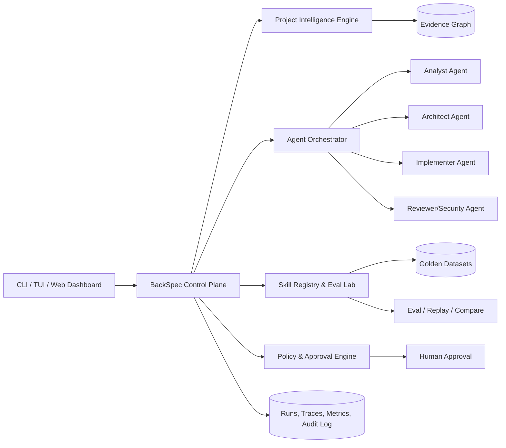

# BÁO CÁO ĐÁNH GIÁ BỘ TOOL BACKSPEC

## Tái đánh giá sau hai increment 2026-09-30

- **Repository/release health:** **100/100** — 16/16 evidence checks pass; quality strict có 0 finding; test, validate và sync check đều pass.
- **Product maturity:** **70/100** — tăng từ baseline 56 nhờ Trust Reset, Quality Gate, CI matrix và package hardening.
- **Chưa đạt 95/100 product maturity.** Khoảng trống còn lại là project intelligence dựa trên AST/evidence graph, runtime điều phối multi-agent và skill eval/regression thực. Không dùng health score 100 để thay thế cho điểm trưởng thành sản phẩm.

Mốc 95 chỉ được xác nhận khi các benchmark ở mục 11 có dữ liệu thực và các năng lực P1 vượt release gate.

> Ngày đánh giá: 2026-09-30  
> Phạm vi: CLI, project analysis, SDD workflow, multi-agent governance, skill registry, safety hooks, dashboard, testing và khả năng product hóa.  
> Phương pháp: đọc mã nguồn, chạy kiểm thử hiện có, chạy kiểm định trên repository hiện tại, kiểm thử fresh-install trong thư mục cô lập và đối chiếu với tài liệu chính thức của các hệ sinh thái liên quan.

> **Cập nhật triển khai cùng ngày:** Increment `feat-backspec-trust-reset` đã hoàn thành sau thời điểm chụp baseline của báo cáo. `doctor`, `validate` và `status` hiện dùng chung Project Layout v2; fresh-install contract đã pass trên 5 engine; test chạy trong fixture tạm; `sync --check` và safe artifact writes đã được bổ sung. Điểm 56/100 bên dưới được giữ làm baseline lịch sử, chưa phải điểm tái đánh giá sau triển khai.

## 1. Kết luận điều hành

**BackSpec có tiềm năng trở thành một bộ công cụ rất mạnh cho Backend Microservice, nhưng phiên bản hiện tại chưa đủ độ tin cậy để tự nhận “Enterprise Ready”.**

- Điểm hiện trạng: **56/100**.
- Mức trưởng thành: **Prototype mạnh / Early Beta**.
- Điểm tiềm năng sau khi hoàn thành backlog P0 và P1: **85–90/100**.
- Khuyến nghị đầu tư: **GO có điều kiện** — nên tiếp tục, nhưng phải ưu tiên tính đúng đắn và khả năng kiểm chứng trước khi mở rộng thêm số lượng skill.

Giá trị khác biệt đáng theo đuổi không nên là “một bản sao Spec-Kit có thêm nhiều prompt”. Vị trí tốt nhất cho BackSpec là:

> **Backend Project Intelligence & Governance Control Plane** — phân tích codebase có bằng chứng, điều phối agent an toàn, đo chất lượng skill bằng eval và cho con người một bảng điều khiển đáng tin cậy.

Hiện BackSpec đã có “khung quản trị” và “ngôn ngữ vận hành”; phần còn thiếu là engine phân tích sâu, runtime điều phối agent, vòng đời huấn luyện/eval skill và nguồn số liệu thật cho dashboard.

## 2. Scorecard

| Hạng mục | Điểm | Nhận định |
|---|---:|---|
| Tầm nhìn và định vị sản phẩm | 13/15 | Đúng nỗi đau của backend enterprise; governance, SDD và safety kết hợp tốt. |
| Độ phủ workflow SDD | 12/15 | Có 18 command, đầy đủ spec → plan → tasks → implement → audit/export. |
| Độ chính xác phân tích dự án | 6/15 | Stack detector và audit chủ yếu dựa trên tên file/keyword; chưa có AST, graph hay evidence-level analysis. |
| Điều phối multi-agent | 4/15 | Hiện mới phân phối context/skill cho nhiều AI engine; chưa có orchestration runtime thực sự. |
| Vòng đời skill và “train skill” | 5/10 | Có registry 41 skill, nhưng chưa có schema đồng nhất, dataset, eval, version promotion hay regression gate. |
| Governance và an toàn | 7/10 | Chính sách tốt; enforcement thực tế còn rời rạc và một số trạng thái bị hard-code. |
| Độ tin cậy và kiểm thử | 3/10 | Doctor, validate và dashboard mâu thuẫn; test chưa cô lập và có thể sửa workspace thật. |
| UX, tài liệu và phân phối | 3/5 | CLI dễ hiểu, tiếng Việt tốt; version, cấu trúc và tuyên bố trong docs chưa đồng bộ. |
| Khả năng mở rộng và portability | 3/5 | Registry trung tâm là nền tốt; adapter engine, Windows/Linux parity và plugin contract còn thiếu. |
| **Tổng** | **56/100** | **Chưa đạt production-grade; nền móng đủ tốt để tái cấu trúc thay vì viết lại từ đầu.** |

## 3. Bằng chứng kiểm chứng trực tiếp

### 3.1. Kết quả trên repository hiện tại

| Kiểm tra | Kết quả |
|---|---|
| `npm run doctor` | Exit 0, báo **100%** và **Enterprise Ready**. |
| `npm run validate` | Exit 1, báo **10 lỗi cấu trúc**. |
| `npm test` | Exit 1; test gọi `sync` trực tiếp trên workspace thật và gặp lỗi quyền ghi `.agents/skills`. Lỗi quyền có yếu tố sandbox, nhưng thiết kế test không cô lập vẫn là lỗi cần sửa. |
| `node tests/validate-project.js` | Exit 0; xác nhận registry có **41 skills**, 0 lỗi. |
| `npm run status` | Exit 0 nhưng hiển thị **0/30 skills**, trong khi `list skills` hiển thị đúng 41. |
| `node bin/backspec.js list skills` | Exit 0, liệt kê đủ **41 skills**. |

### 3.2. Fresh-install test

Một project trống được tạo trong thư mục tạm, chạy `init --ai claude`, sau đó chạy ba lệnh kiểm định. Thư mục tạm đã được xóa sau kiểm tra.

| Bước | Kết quả |
|---|---|
| `init` | Exit 0, thông báo hoàn tất và đã đồng bộ 41 skills. |
| `doctor --strict` ngay sau init | Exit 1, chỉ đạt **31%**, báo thiếu toàn bộ `registry/*`. |
| `validate` ngay sau init | Exit 1, báo **10 lỗi** do vẫn yêu cầu cấu trúc cũ `01-spec-management`…`04-management`. |
| `status` ngay sau init | Exit 0, vẫn hiển thị **0/30 skills** và `Strict Guard: ACTIVE`. |

Kết luận: lỗi không chỉ nằm ở repository phát triển. **Output do chính `init` sinh ra không thỏa mãn `doctor`, `validate` và `status` của cùng phiên bản.** Đây là blocker P0.

### 3.3. Số liệu repository

- 41 skill, trung bình khoảng 59,8 dòng/skill; skill ngắn nhất 16 dòng.
- 18 module command CLI.
- 7 rule governance.
- Chỉ có 2 file test JavaScript.
- 30/41 skill có `allowed-tools`; chỉ 2/41 có `category`, `version`, `triggers`.
- Thiếu `LICENSE`, `CHANGELOG.md`, `SECURITY.md`, `CONTRIBUTING.md` và CI workflow dù README tuyên bố MIT và định vị sản phẩm public/enterprise.

## 4. Điểm mạnh nên giữ lại

### 4.1. Tư duy sản phẩm đúng hướng

BackSpec giải quyết cùng lúc bốn vấn đề thường bị tách rời:

1. Chuẩn hóa đặc tả trước khi code.
2. Đưa quy tắc kiến trúc vào context của coding agent.
3. Chặn lỗi backend enterprise như entity leak, hard delete, thiếu idempotency và sai transaction boundary.
4. Giữ quyền phê duyệt cuối cùng cho con người.

Đây là một định vị tốt, đặc biệt với nhóm Java/Spring, Go, NestJS, FastAPI và .NET đang vận hành microservice.

### 4.2. Registry trung tâm là nền tảng đúng

`registry/skills`, `registry/rules`, `registry/dna` và `registry/hooks` tạo ra một nguồn phát hành chung. Nếu bổ sung schema, adapter và compatibility test, mô hình này có thể trở thành “package manager cho engineering governance”.

### 4.3. CLI dễ khám phá

Tên lệnh rõ, workflow tuyến tính, output terminal dễ đọc và hỗ trợ tiếng Việt tốt. `list skills`, `--help` và quy trình spec/plan/tasks tạo cảm giác sử dụng thuận tiện.

### 4.4. Bộ tri thức backend có giá trị

Các chủ đề như Transactional Outbox, Idempotency, N+1, transaction boundary, Redis, middleware, migration và secret scanning phù hợp với lỗi thực tế ở backend enterprise. Đây là tài sản nội dung đáng giữ và nâng cấp bằng eval, không nên bỏ đi.

## 5. Các vấn đề nghiêm trọng

### P0-01 — Ba mô hình cấu trúc đang xung đột

- `init` sinh cấu trúc mới: `.sdd/`, `registry` thuộc package nguồn và skill theo từng engine.
- `validate` và `status` vẫn đọc cấu trúc cũ: `01-spec-management`, `02-codestyle`, `03-hooks`, `04-management`.
- `doctor` yêu cầu `registry/*` tồn tại trong project người dùng, dù `init` không copy registry vào project đích.
- `human-master-map` và `docs/HUMAN_PROJECT_MAP.md` vẫn mô tả đường dẫn cũ, thậm chí chứa đường dẫn tuyệt đối của project khác.

**Tác động:** người dùng mới không thể có trạng thái “healthy” bằng chính workflow chính thức.

**Sửa:** định nghĩa một `ProjectLayout v2` duy nhất, cho mọi command dùng chung resolver/schema; tạo contract test `init → doctor → validate → status` trên fixture sạch.

### P0-02 — Health score tạo false confidence

`doctor` hiện chủ yếu kiểm tra `existsSync`. File governance còn placeholder như `{{SERVICE_NAME}}`, `{{BACKEND_STACK}}`, `{{DB_ENGINE}}` vẫn được tính là pass. Có thư mục `.husky` cũng được coi là hooks đã kích hoạt.

Trong repository hiện tại, `doctor` báo 100%/Enterprise Ready trong khi `validate` thất bại. Đây là lỗi nghiêm trọng đối với một sản phẩm có nhiệm vụ kiểm soát chất lượng.

**Sửa:** mọi claim phải có evidence và rule ID; blocker phải làm command exit non-zero mặc định trong CI; bỏ nhãn Enterprise Ready cho đến khi các gate bắt buộc cùng pass.

### P0-03 — “Cross-Audit” chưa thực sự đối soát hai chiều

Các bằng chứng trong mã nguồn:

- `missingItems` được khởi tạo nhưng không được thêm dữ liệu, sau đó report có thể kết luận “không phát hiện thiếu sót”.
- Input doc/image chỉ được liệt kê; nội dung không được so khớp requirement-by-requirement với spec.
- `parseImage()` chỉ đọc tên file, kích thước và extension; không phân tích ERD/sequence/UI như README mô tả.
- Scanner coi hầu hết `.java`, `.go`, `.ts` là entity trước khi kiểm tra controller, làm thống kê controller sai.
- `analyze` tính health chủ yếu theo việc file có tồn tại; các cảnh báo consistency không làm giảm score.

**Tác động:** Fidelity Score hiện chưa phải một chỉ số có thể dùng để phê duyệt triển khai.

**Sửa:** hoặc đổi tên thành `template-lint` cho đúng năng lực hiện tại, hoặc xây engine evidence-based với requirement IDs, source citations, AST/schema diff và confidence score.

### P0-04 — Sinh artifact có nguy cơ ghi đè nội dung người dùng

`spec`, `plan`, `tasks`, `clarify`, `checklist`, `pr` có nhiều lệnh `writeFileSync` trực tiếp. Đặc biệt `plan` và `tasks` có thể ghi đè phần con người đã chỉnh mà không yêu cầu `--force`, không preview diff và không backup.

**Sửa:** atomic write, `--dry-run`, `--force`, diff preview, backup/recovery và ownership marker theo section. Mặc định chỉ tạo file mới hoặc patch section do BackSpec sở hữu.

### P0-05 — Test suite không cô lập

`tests/test-skill-system.js` gọi `node bin/backspec.js sync` trên chính repository nguồn. Test vì vậy thay đổi manifest/thời gian cập nhật và cố ghi vào các thư mục engine thật.

**Sửa:** dùng temporary fixture, dependency injection cho clock/filesystem, snapshot output và cleanup; test tuyệt đối không sửa working tree của developer.

### P0-06 — Safety được công bố mạnh hơn enforcement thực tế

- `.husky/pre-commit` chỉ chạy `lint-staged`; cấu hình lint-staged cho source code hiện chỉ `echo`, không chạy linter thật.
- Bốn script trong `registry/hooks` chưa được nối vào `.husky` hiện hành.
- Dashboard hard-code `Strict Guard: ACTIVE` và `Human Authority: ENABLED`, không đo trạng thái thực.
- `override` chỉ ghi log; chưa có cơ chế token/scope/expiry để guard thực sự đọc và áp dụng.

**Sửa:** xây capability probe cho từng guard; chỉ hiện ACTIVE khi hook/config/test probe pass. Override phải có scope, người duyệt, thời hạn, chữ ký hoặc checksum và audit trail bất biến.

## 6. Khoảng trống multi-agent và “train skill”

### 6.1. Multi-engine chưa đồng nghĩa multi-agent

BackSpec hiện đồng bộ instruction sang nhiều thư mục agent. Đây là **multi-engine context distribution**, chưa phải **multi-agent orchestration**.

Để trở thành control plane, cần có:

- Agent role registry: analyst, architect, implementer, tester, reviewer, security.
- Task DAG và dependency-aware scheduler.
- Task lease/lock để tránh hai agent sửa cùng file.
- Handoff contract có input, output, evidence và acceptance criteria.
- Workspace/worktree isolation cho mỗi agent.
- Approval gate và quyền hạn theo role.
- Retry, timeout, budget, cancellation, resume và idempotency cho agent run.
- Trace đầy đủ của prompt, tool call, file diff, decision và reviewer verdict.

### 6.2. “Train skill” nên được định nghĩa là Skill Engineering

BackSpec hiện chưa train model; nó phân phối tài liệu hướng dẫn. Để tạo vòng lặp cải tiến có thể đo lường, nên dùng quy trình:

```text
Production failures / human feedback
              ↓
      Golden eval dataset
              ↓
  Skill candidate + versioned prompt
              ↓
 Offline replay / multi-model evaluation
              ↓
 Safety + quality + cost regression gates
              ↓
 Canary release → stable promotion → rollback
```

Mỗi skill cần schema tối thiểu:

- `name`, `version`, `category`, `description`, `triggers`.
- `inputs`, `outputs`, `preconditions`, `postconditions`.
- `allowed_tools`, `permissions`, `side_effects`, `risk_level`.
- `dependencies`, `conflicts`, `supported_engines`.
- Ví dụ đúng, anti-example, failure modes và fallback.
- Eval cases, expected evidence, minimum pass rate và changelog.

Không nên đo chất lượng skill bằng số lượng skill. KPI đúng là task success, instruction adherence, tool-selection accuracy, regression rate, human correction rate, latency và cost.

## 7. Benchmark với chuẩn thị trường

Benchmark được chụp tại thời điểm 2026-09-30 từ nguồn chính thức:

| Chuẩn tham chiếu | Năng lực thị trường | Khoảng trống của BackSpec |
|---|---|---|
| [GitHub Spec Kit](https://github.com/github/spec-kit/blob/main/docs/index.md/) | Workflow/preset/extension/bundle, hỗ trợ nhiều coding-agent integration, existing-project flow và hệ sinh thái mở rộng. | BackSpec mới có workflow tuyến tính và 5 engine được quảng bá; chưa có extension contract, catalog, preset composition hay compatibility matrix thực chứng. |
| [OpenAI Agents observability](https://developers.openai.com/api/docs/guides/agents/integrations-observability) | Trace model call, tool call, handoff, guardrail và custom span. | BackSpec chưa có runtime trace hoặc run ID xuyên suốt. |
| [OpenAI Agent Evals](https://developers.openai.com/api/docs/guides/agent-evals) | Dataset, grader, trace grading và eval run để chống regression. | BackSpec chưa có eval dataset/runner/grader cho agent hoặc skill. |
| [Google Agents CLI Evaluation](https://google.github.io/agents-cli/guide/evaluation/) | Tách generate/grade, nhiều metric về tool use, trajectory, task success và vòng lặp eval-fix. | BackSpec chưa đo được chất lượng route, tool use, handoff hay kết quả cuối. |

### Cơ hội cạnh tranh

Không nên cạnh tranh trực diện bằng số integration hoặc số prompt. BackSpec có cơ hội thắng ở chiều sâu backend:

1. Evidence graph từ endpoint → service → transaction → repository → table → event → consumer.
2. Policy-as-code chuyên cho microservice và database safety.
3. Spec/code drift detection theo bounded context.
4. Human governance có audit trail và approval thật.
5. Skill eval chuyên theo stack Java/Go/Node/Python/.NET.

## 8. Kiến trúc mục tiêu đề xuất



Nguyên tắc cốt lõi: **mọi điểm số phải truy ngược được về evidence; mọi hành động ghi phải có diff; mọi agent run phải quan sát và tái lập được; mọi skill release phải qua eval.**

## 9. Lộ trình 90 ngày

### Giai đoạn 1 — Tuần 1–2: Trust Reset

Mục tiêu: không còn kết quả mâu thuẫn hoặc claim sai.

- Hợp nhất `ProjectLayout v2` và xóa mọi đường dẫn cấu trúc cũ.
- Sửa `doctor`, `validate`, `status`, `sync --check` dùng chung schema.
- Thêm fresh-install contract test trên Windows và Linux.
- Làm test suite hermetic; working tree phải sạch sau test.
- Thêm safe-write/diff/force/backup.
- Đồng bộ version từ một nguồn duy nhất.
- Gỡ nhãn Enterprise Ready cho đến khi release gate pass.

**Exit criteria:** `init → doctor --strict → validate → test` đều exit 0 trên fixture sạch; dashboard hiển thị đúng 41 skill.

### Giai đoạn 2 — Tuần 3–5: Project Intelligence MVP

- Xây plugin parser theo stack; bắt đầu với Java/Spring và NestJS.
- Trích xuất endpoint, DTO, service call, transaction, repository, entity, migration, event producer/consumer.
- Sinh evidence graph với `file:line` và confidence.
- Audit requirement ID ↔ spec section ↔ code evidence.
- Đổi Fidelity Score thành score có công thức, evidence và uncertainty rõ ràng.

**Exit criteria:** benchmark trên ít nhất 10 repository mẫu; precision/recall cho endpoint/entity/event ≥ 90% ở hai stack đầu tiên.

### Giai đoạn 3 — Tuần 6–8: Skill Engineering Lab

- Chuẩn hóa Skill Schema v2 cho 41 skill.
- Tạo `backspec skill lint|test|eval|compare|promote|rollback`.
- Mỗi skill quan trọng có tối thiểu 10 eval cases gồm happy, edge, adversarial và cross-platform.
- Lưu score theo skill version, model/engine và stack.
- Routing dựa trên trigger + precondition thay vì chỉ tên skill.

**Exit criteria:** 100% skill lint pass; top 10 skill có regression gate và pass rate mục tiêu ≥ 90%.

### Giai đoạn 4 — Tuần 9–11: Multi-Agent Control Plane

- Task DAG, role registry, handoff contract và workspace isolation.
- Run state có resume/cancel/retry/budget.
- Human approval gate cho migration, security, production config và protected files.
- Trace mọi tool call, diff và decision.
- Tích hợp tối thiểu hai runtime/engine bằng adapter thật, không chỉ copy Markdown.

**Exit criteria:** một feature mẫu chạy analyst → architect → implementer → reviewer với trace đầy đủ, không conflict file và có approval gate.

### Giai đoạn 5 — Tuần 12–13: Productization

- CI matrix Windows/Linux và các Node LTS được hỗ trợ.
- `LICENSE`, `CHANGELOG`, `SECURITY`, `CONTRIBUTING`, release automation.
- Package allowlist qua trường `files`, `engines`, repository metadata và provenance.
- Quickstart 5 phút, migration guide, troubleshooting và sample repositories.
- Dashboard lấy dữ liệu thật từ run/eval/policy store.

**Exit criteria:** release candidate cài được từ package sạch, không phụ thuộc đường dẫn máy phát triển, có rollback và upgrade test.

## 10. Backlog ưu tiên

### P0 — Phải hoàn thành trước mọi tuyên bố production

1. Một project layout duy nhất cho tất cả command.
2. Fresh-install contract test và hermetic test suite.
3. Health score evidence-based, không hard-code ACTIVE/READY.
4. Safe artifact writes và chống ghi đè.
5. Sửa audit false-negative/false-positive; tạm hạ claim nếu chưa có engine thật.
6. Nối hook thật hoặc báo đúng trạng thái inactive.
7. Đồng bộ version, docs, path và loại bỏ placeholder trong project mẫu.

### P1 — Tạo lợi thế cạnh tranh

1. Evidence graph và AST parser theo stack.
2. Spec/code drift detection.
3. Skill Schema v2 + eval datasets + regression gate.
4. Multi-agent DAG, handoff, isolation và trace.
5. Policy-as-code với approval/override có scope và expiry.
6. Metrics thật: success, correction, violations, cost, latency, coverage.

### P2 — Mở rộng hệ sinh thái

1. Plugin/adapter SDK và compatibility certification.
2. Catalog/marketplace riêng cho backend governance packs.
3. TUI/Web dashboard và report export JSON/SARIF/HTML.
4. Monorepo/multi-repo graph và organization policy inheritance.
5. Cloud/on-prem control plane cho enterprise.

## 11. KPI để chứng minh “số 1”

Không dùng số skill hay số command làm KPI chính. Nên công bố dashboard với:

| KPI | Mục tiêu 6 tháng |
|---|---:|
| Fresh-install success rate | ≥ 99% |
| False Enterprise-Ready verdict | 0 |
| Project-analysis precision/recall | ≥ 90% trên stack được chứng nhận |
| Skill eval pass rate | ≥ 90% cho skill stable |
| Regression escape rate | < 2% |
| Human correction rate | Giảm ≥ 50% sau 3 vòng eval |
| Agent task success | ≥ 85% trên benchmark nội bộ |
| Trace completeness | 100% run có tool/diff/decision evidence |
| Recovery | 100% write operation có preview hoặc rollback |
| Time-to-first-value | ≤ 5 phút từ install đến report đầu tiên |

## 12. Quyết định cuối cùng

**Nên tiếp tục phát triển BackSpec. Không nên viết lại toàn bộ.** Registry, CLI vocabulary, backend knowledge base và governance triangle đều có giá trị. Tuy nhiên, trong 90 ngày tới cần dừng chiến lược “thêm nhiều skill/claim” và chuyển sang chiến lược “evidence, eval, orchestration, reliability”.

Thứ tự đúng là:

1. Làm cho tool tự nhất quán.
2. Làm cho mọi kết luận có bằng chứng.
3. Làm cho skill có thể đo và cải tiến.
4. Làm cho agent có thể phối hợp, quan sát và kiểm soát.
5. Sau đó mới mở marketplace và mở rộng số engine.

Nếu thực hiện đúng thứ tự này, BackSpec có cơ hội trở thành sản phẩm dẫn đầu trong ngách **quản trị phát triển backend bằng AI agent**, thay vì chỉ là một bộ template SDD lớn.
